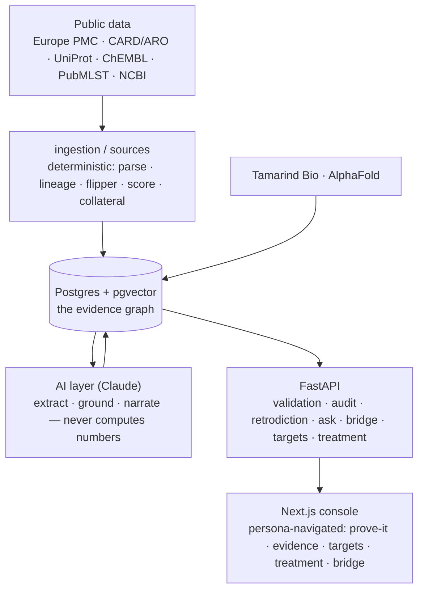

<p align="center"></p>

<p align="center"><b>An evidence-grounded discovery console — grounded answers you can re-verify, not take on trust.</b></p>

<p align="center"><em>Deterministic core · provenance on every edge · reproducible from public data · MIT</em></p>

<p align="center">
<a href="https://achilles-science.vercel.app">Live app</a> ·
<a href="https://achilles-science.vercel.app/methods">Methods</a> ·
<a href="https://achilles-science.vercel.app/bridge">Research ⇄ clinic bridge</a>
</p>

---

Point Achilles at your data — strains, variants, a literature set — and it builds a
**provenance-checked evidence graph**: every claim carries a citation, a deterministic
core does the math, and the language model only reads, retrieves, and cites. Nothing is
asserted without a source, and the whole validation result reduces to a **tamper-evident
hash-chained ledger you can re-verify**.

The console is **domain-agnostic**. Antimicrobial resistance (*Burkholderia multivorans*)
is the worked example, loaded behind a "Demo data" toggle — not the product's identity.

## The one idea

**Claude proposes, code decides.** A deterministic Python core computes everything
quantitative — lineage reconstruction, flipper (allele-reversal) detection, the target
rank score, the collateral-sensitivity math. The model does exactly two things: extracts
typed claims from literature, and narrates already-computed results with citations. It
never invents a number, a score, or a schedule.

The core object is an evidence edge — `(source, relation, target, provenance, confidence)`
— and **provenance is never null**: a PubMed PMID and, where corroborated, a CARD/ARO,
UniProt, or ChEMBL accession. If a claim can't be grounded, it doesn't become an edge.

## Verify it yourself

This is the part a search box or a black box can't do. On the live app, in the
**Validation** chapter:

- **Recall + adversarial refusal, live.** Held to **29 independent, publicly-cited
  controls**: it recovers known biology (**12/12**), refuses an adversarial battery of
  plausible-but-false claims — the traps a hallucinating model falls for (**17/17**) — and
  fabricates nothing (**0**). `GET /api/validation`.
- **Red-team it.** Type your own claim; it says *supported* (with a citation) only if
  grounded evidence backs it, otherwise *refused*. `GET /api/validation/redteam`.
- **Retrodiction — foresight, not just recall.** Freeze the literature at a cutoff year and
  measure how many later-confirmed relationships the pre-cutoff graph already pointed at.
  No false claim is ever "anticipated." `GET /api/validation/retrodiction`.
- **Tamper-evident audit ledger.** Every control verdict is an entry in a sha256
  hash-chain, so the whole result is one fingerprint. "Re-verify" re-walks it; a "Tamper
  test" flips a verdict and shows exactly where the chain breaks. `GET /api/audit` ·
  `POST /api/audit/verify`.

## What's in the console

Load the demo (or bring your own data) and the pipeline lights up:

1. **Lineage & flippers** — an interactive tree over allelic distance, nodes colored by
   flipper load (reversible loci along each isolate's path). Organism-agnostic: drop any
   genotype CSV in *Bring your own data*.
2. **Evidence graph** — grounded search + per-gene evidence with confidence gradients and
   clickable PMID / CARD-ARO / UniProt chips; grounded vs abstract-only is visually
   distinct.
3. **Target identification** — evidence-supported genes ranked by a deterministic 0–1 score
   with ChEMBL tractability and a citation-backed rationale.
4. **Structure & docking** — the target folded by **AlphaFold via
   [Tamarind Bio](https://www.tamarind.bio/)** (colored by pLDDT), and a **cited** efflux
   inhibitor (CCCP, CARD:ARO:3000074) *ready to dock* into it — cited chemistry, no
   fabricated pose.
5. **Treatment optimization** — a deterministic antibiotic **cycle** over the reciprocal
   collateral-sensitivity graph, pairs cited to the literature (PMID 32335276), always
   labelled a **research hypothesis, never a treatment recommendation**.
6. **Ask Achilles** — grounded Q&A: the answer is built only from cited evidence (every
   claim numbered and linked), or it refuses. `GET /api/ask`.
7. **Research ⇄ clinic bridge** — one grounded finding shown to a researcher (mechanism,
   target, structure) and a physician (drugs it drives resistance to, the cited
   collateral-sensitivity opening) at once, carrying the same citations across the handoff.
   `GET /api/bridge`.

Everything runs **fully offline** from a committed public corpus — the demo never depends
on a live API succeeding on camera.

## Call it from Claude (MCP)

Achilles isn't just an app — it's grounded science any Claude agent can call. The
[**Achilles MCP server**](mcp_server/) exposes the graph as tools in Claude Code and Cowork:
`ask`, `ground_claim`, `rank_targets`, `validate`, `bridge`. A `.mcp.json` at the repo root
makes Claude Code discover it automatically, and a companion **Claude Skill**
([`.claude/skills/achilles/`](.claude/skills/achilles/SKILL.md)) teaches any Claude session
when to reach for each tool and how to keep the cite-or-refuse guarantee intact. The agent
inherits the guarantee — it cites, or it refuses:

> **You:** Is MarR → ciprofloxacin resistance grounded, and what are the top targets?
> **Claude:** *(calls `ground_claim` → supported, CARD:ARO:3003378; `rank_targets` → …)*

## How grounding works (the credibility gate)

```
Europe PMC abstracts ─▶ LLM extraction (typed claims) ─▶ grounding vs CARD/ARO + UniProt ─▶ decide_edge
```

| Outcome | Edge? | Provenance | Confidence |
|---|---|---|---|
| Corroborated by a reference DB | ✅ `grounded` | PMID **+** ARO / UniProt accession | ≥ 0.5 |
| Stated in the abstract only | ✅ `abstract-only` | PMID only | < 0.5 |
| No textual support | ❌ dropped | — | — |

The tier logic is plain, unit-tested Python (`ai/grounding.decide_edge`) — the LLM
proposes, deterministic rules dispose.

## Architecture



- **Backend:** FastAPI, SQLAlchemy 2 (async), Pydantic v2, Postgres + pgvector. 139 tests.
- **AI layer:** Anthropic API (config-driven models), structured-output extraction +
  reference grounding; Tamarind Bio for AlphaFold structure prediction.
- **Frontend:** Next.js (App Router), TypeScript, Tailwind, Geist. D3 lineage tree, Mol\*
  structure viewer.
- **Contracts:** Pydantic models in `backend/app/models/` mirror
  `frontend/src/lib/types.ts` — extend with optional fields, never break a shape.

## Domain-agnostic by construction

Domains are config, not forks. [`backend/app/ingestion/domains.py`](backend/app/ingestion/domains.py)
holds a registry; `seed.py` derives its organism and reference genes from it (a test proves
the config *is* what drives ingestion). `GET /api/domains` reports each domain and whether
it can seed today. A second organism (*Pseudomonas aeruginosa*) is scaffolded — its PubMLST
DB, MLST scheme, and corpus builder are wired; populating its grounded data is a documented,
network-run step (real accessions only, never invented): see [`DRIVE_B.md`](DRIVE_B.md). The
deterministic core is already organism-agnostic — proven by a generalization test and by
*Bring your own data*.

## Data & ethics

- **Your data stays yours.** Data you upload in *Bring your own data* is processed in
  memory and returned — never written to the database, never sent to the model, never
  logged (verified: the upload path imports no DB and no AI layer). See
  [`PRIVACY.md`](PRIVACY.md) for the guarantee and the owner-scoped isolation architecture
  for saved projects.
- **Public sources only** in this repo: Europe PMC / PubMed, CARD (ARO), UniProt, ChEMBL,
  PubMLST, NCBI, AlphaFold (via Tamarind), RCSB. Edges are keyed to public gene symbols /
  reference locus tags.
- **The richer local dataset (BurkData) is private** (unpublished experimental-evolution
  data), git-ignored, and **never committed** — no committed artifact is derived from it.
- Cycling suggestions and the clinical bridge are **research decision-support, not a
  diagnosis, prescription, or treatment recommendation.**

## Limitations (stated plainly)

- The 29-control set is small relative to a large-N benchmark; the strength is the
  *property* (recall + adversarial refusal + zero fabrication) and the live red-team + ledger.
- The second domain is a scaffold — the pipeline is wired for it, but its grounded data must
  be fetched, not assumed.
- Docking shows a cited inhibitor *ready to dock*; a computed pose requires a Tamarind run.
- Lineage is a deterministic reconstruction from allelic distance, not a validated phylogeny.

Full write-up at [`METHODS.md`](METHODS.md) (and live at `/methods`). Design brief in
[`CLAUDE.md`](CLAUDE.md).

## License

MIT. The repo is kept clean of any non-redistributable dataset.
