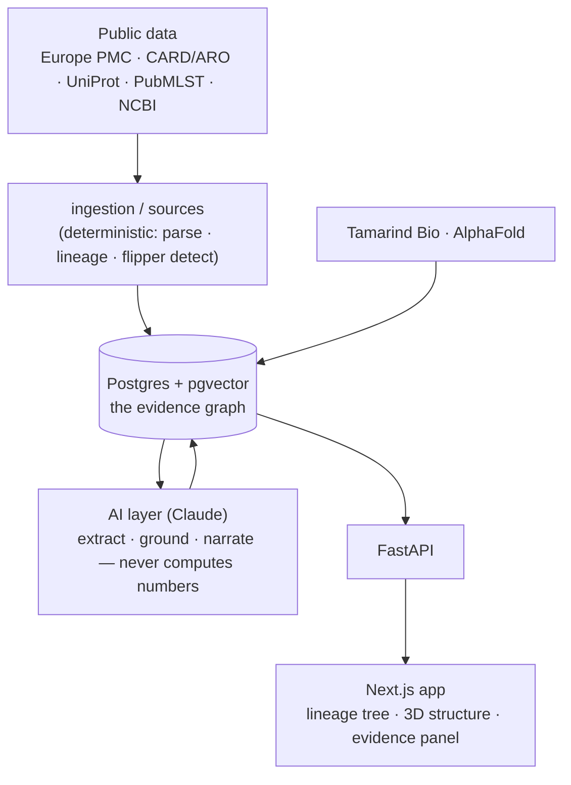

# Achilles

**Find the pathogen's Achilles' heel — the vulnerability that resistance creates.**

Achilles is an AI-native database and web app for **antimicrobial-resistance (AMR)
target identification and treatment optimization**. Nextstrain shows you *how strains
are related*; Achilles continues the chain — **strain → flipper → structure → target →
literature evidence** — and turns reversible ("flipper") mutation structure into
evidence-backed antibiotic-cycling hypotheses.

> When a bug evolves resistance to one drug, it often becomes *more* sensitive to
> another. That trade-off — **collateral sensitivity** — is the weak point evolution
> hands us. Achilles makes it findable, grounded, and citable.

<p align="center"><em>Deterministic core · AlphaFold on top · provenance on every edge</em></p>

---

## The one idea that governs everything

**The product is the graph, not the pipeline or the viz.** The core object is an
`evidence_edge`: `(source, relation, target, provenance, confidence)`. **Provenance is
never null** — every edge points to a PubMed PMID and, where corroborated, a CARD/ARO
or UniProt accession. *If a claim can't be grounded, it doesn't become an edge.*

A deterministic Python core does all the computing (parsing, lineage/flipper
detection, collateral-sensitivity math). The LLM is used for exactly two things —
extracting typed claims from literature, and narrating with citations. **It never
invents a number.**

## What you can do in the demo

1. **Trace a real lineage.** An interactive D3 tree of *Burkholderia multivorans*
   isolates, each node colored by its **flipper load** (reversible loci along its
   evolutionary path). Click a strain to inspect it.
2. **Fold a target in 3D.** Pick a flipper gene and its protein is folded by
   **AlphaFold via [Tamarind Bio](https://www.tamarind.bio/)** (RCSB fallback for
   known structures), rendered in 3D and colored by per-residue **pLDDT** confidence.
   The MarR multidrug-resistance regulator ships pre-folded (pLDDT 88).
3. **Read the evidence, with receipts.** Select a gene and the **Evidence panel**
   shows each resistance edge — relation + target, a confidence gradient, a
   grounded/abstract-only badge, and clickable **PMID / CARD-ARO / UniProt** chips.
   Grounded edges look solid; abstract-only edges are honestly weaker.

Everything runs **fully offline** from a committed public corpus — the demo never
depends on a live API succeeding on camera.

## How grounding works (the credibility gate)

```
Europe PMC abstracts ──▶ LLM extraction (typed claims) ──▶ grounding vs CARD/ARO + UniProt ──▶ decide_edge
```

| Outcome | Edge? | Provenance | Confidence |
|---|---|---|---|
| Corroborated by a reference DB | ✅ `grounded` | PMID **+** ARO/UniProt accession | ≥ 0.5 |
| Stated in the abstract only | ✅ `abstract-only` | PMID only | < 0.5 |
| No textual support | ❌ dropped | — | — |

The tier logic is plain, unit-tested Python (`ai/grounding.decide_edge`) — the LLM
proposes, deterministic rules dispose.

## Architecture



- **Backend:** FastAPI, SQLAlchemy 2 (async), Pydantic v2, Postgres + pgvector.
- **AI layer:** Anthropic API (config-driven models), structured-output extraction +
  reference grounding; Tamarind Bio for AlphaFold structure prediction.
- **Frontend:** Next.js (App Router), TypeScript, Tailwind, **Geist** fonts; D3
  lineage tree, 3Dmol.js structure viewer.
- **Contracts:** Pydantic models in `backend/app/models/` mirror
  `frontend/src/lib/types.ts` — extend with optional fields, never break a shape.

## Quickstart

```bash
cp .env.example .env         # works out of the box; add keys only for live/AI features
make db                      # Postgres + pgvector (docker), schema auto-loaded
make seed                    # load the demo graph (offline, idempotent)
make backend                 # FastAPI on :8000
make frontend                # Next.js on :3000  → open it
```

`make seed` needs **no network and no API key** — it replays a committed public
corpus (PubMed abstracts + CARD/UniProt reference facts) into the evidence graph. Set
`ANTHROPIC_API_KEY` / `TAMARIND_API_KEY` only to *build new* literature or fold *new*
targets on demand.

## Data & ethics

- **Public sources only** in this repo: Europe PMC / PubMed, CARD (ARO via EBI OLS),
  UniProt, PubMLST, NCBI. Evidence edges are keyed to public gene symbols / reference
  locus tags.
- **The richer local dataset (BurkData) is private** (unpublished experimental-
  evolution data) and is **never committed** — it's git-ignored, and no committed
  artifact is derived from it. With it present locally, `make seed` loads the real 47-
  isolate / 11-lineage experiment; without it (a fresh clone), the seed falls back to
  the public PubMLST lineage. Both paths give a working evidence + structure demo.
- Cycling suggestions are **research hypotheses, not treatment recommendations.**

## Status

| Phase | What | State |
|---|---|---|
| 1 | Data in, lineage tree out | ✅ shipped |
| 2 | Literature → grounded evidence edges | ✅ shipped |
| 5 (beat) | AlphaFold structure viewer (Tamarind) | ✅ shipped |
| 3 | Target ranking + pgvector retrieval | ▶ next |
| 4 | Collateral-sensitivity cycling | ▶ next |

See `CLAUDE.md` for the full design brief and phase plan.

## License

MIT. The repo is kept clean of any non-redistributable dataset.
